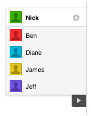
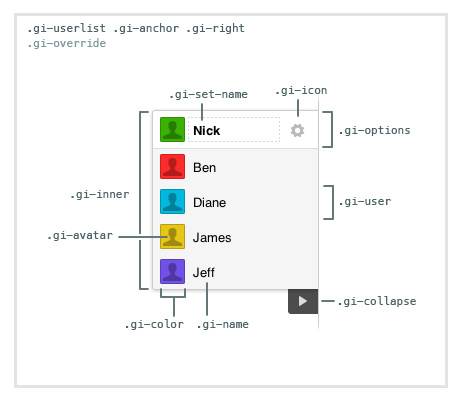

# User List

[Github Link](html/user_list_github.html "include")

The User List widget provides a real-time connected list of users inside
a room of your application.



You can render it collapsed, specify a container to render it in, position it
on the left or right of the page, and truncate user displaynames after a
certain length.

The displayed name for a user comes from the user's `displayName` attribute,
passed along with their JWT, and set on the key `/users/:id`.

## Table of Contents

1. [Code Example](#code-example)
1. [HTML](#html)
1. [CSS](#css)
1. [Constructor](#constructor)
1. [UserList#initialize](#userlist#initialize)
1. [UserList#destroy](#userlist#destroy)
1. [Related Information](#related-information)

## Code Example

### 1. Include our CDN assets:

#### Note on Versioning

Specific version of widgets can be found on our [CDN](https://cdn.goinstant.net/).

```html
<script type="text/javascript" src="https://cdn.goinstant.net/v1/platform.min.js"></script>
<script type="text/javascript" src="https://cdn.goinstant.net/widgets/user-list/latest/user-list.min.js"></script>
<!-- CSS is optional -->
<link rel="stylesheet" href="https://cdn.goinstant.net/widgets/user-list/latest/user-list.css" />
```

```js
// Connect URL
var url = 'https://goinstant.net/YOURACCOUNT/YOURAPP';

// Connect to GoInstant
goinstant.connect(url, function(err, platformObj, roomObj) {
  if (err) {
    throw err;
  }

  // Create a new instance of the UserList widget
  var userList = new goinstant.widgets.UserList({
    room: roomObj,
    collapsed: true,
    position: 'left'
  });

  // Initialize the UserList widget
  userList.initialize(function(err) {
    if (err) {
      throw err;
    }
    // Now it should render on the page with any connected users
  });
});
```

## HTML

### User List

The widget is rendered to a `div` that is appended to page body after `#initialize` has successfully completed.
There are three child elements in a user list: `gi-options`, `gi-inner`, and `gi-collapse`.
The `gi-options` div is a container for the user options UI.
The `.gi-inner` ul contains the list of users.
Lastly, the `gi-collapse` div is a container for the collapse button.

```html
<div class="gi-override gi-userlist">
  <div class="gi-options"></div>
  <ul class="gi-inner">
    <!-- User List goes inside here -->
  </ul>
  <div class="gi-collapse"></div>
</div>
```

### User Element

Each user is a `list-item` appended to a `ul` inside of the `.gi-userlist` div. There are three child elements for each user display name: `.gi-name`, avatar block: `.gi-avatar`, and `.gi-color`.
The `.gi-avatar` div is a container for the avatar image: `.gi-avatar-img`.
The `.gi-user` element gets a unique data attribute of `goinstant-id` containing each user's GoInstant user id as a standard way to identify users.

```html
<div class="gi-userlist">
  <div class="gi-options"></div>
  <ul class="gi-inner">
    <li class="gi-user" data-goinstant-id="1234">
      <div class="gi-color">

        <div class="gi-avatar">
          
        </div>

      </div>

      <div class="gi-name">
        <span>Guest</span>
      </div>
    </li>
  </ul>
  <div class="gi-collapse"></div>
</div>
```

## CSS

### Note on gi-override

Each class is prefixed with `gi` to avoid conflicts.  The top-level container
also has a `.gi-override` class. Our goal is to make each widget as easy as
possible to customize.

If you have not included our CSS file, you do not need to use the `gi-override`
class when styling the widget.



This stylesheet provides a good starting point for customizing the user list.

```css
.gi-userlist.gi-override {
  /* Add custom styles */
}

.gi-userlist.gi-override .gi-inner {
  /* Add custom styles */
}

.gi-userlist.gi-override .gi-user {
  /* Add custom styles */
}

.gi-userlist.gi-override .gi-avatar {
  /* Add custom styles to the avatar container */
}

.gi-userlist.gi-override .gi-avatar-img {
  /* Add custom styles to the avatar image */
}

.gi-userlist.gi-override .gi-color {
  /* Add custom styles to the color container */
}
```

## Constructor

Creates the UserList instance with customizable options.

### Methods

- ###### **new UserList(optionsObject)**

### Parameters

| optionsObject |
|:---|
| Type: [Object](https://developer.mozilla.org/en-US/docs/Web/JavaScript/Reference/Global_Objects/Object) |
| An object with the following properties: |
| - `room` is the [Room](https://developers.goinstant.net/v1/rooms/index.html).|
| - `container` is an optional DOM element that, if provided, the user list will render in.|
| - `position` [**default: 'right'**] is a [String](https://developer.mozilla.org/en-US/docs/Web/JavaScript/Reference/Global_Objects/String), either "left" or "right", for setting the initial side of the browser window that the user list is anchored to.|
| - `collapsed` [**default: false**] is a [Boolean](https://developer.mozilla.org/en-US/docs/Web/JavaScript/Reference/Global_Objects/Boolean) where, if true, the user list will be initially rendered collapsed.|
| - `truncateLength` determines the maximum length of a user's display name before they are truncated in the list.|
| - `avatars` [**default: true**] is a [Boolean](https://developer.mozilla.org/en-US/docs/Web/JavaScript/Reference/Global_Objects/Boolean) that enables or disables user avatars. |
| - `userOptions` [**default: true**] is a [Boolean](https://developer.mozilla.org/en-US/docs/Web/JavaScript/Reference/Global_Objects/Boolean) that enables or disables user options, which allows users to change their display name. |
| - `userTemplate` [**default: null**] is a [Function](https://developer.mozilla.org/en-US/docs/Web/JavaScript/Reference/Global_Objects/Function) that takes an [Object](https://developer.mozilla.org/en-US/docs/Web/JavaScript/Reference/Global_Objects/Object) of template variables and returns a [String](https://developer.mozilla.org/en-US/docs/Web/JavaScript/Reference/Global_Objects/String) representation of the HTML for the user view. This allows you to use the templating engine of your choice to format the user view. The default template can be found [here.](https://github.com/goinstant/user-list/blob/master/templates/user-template.html) |

### Example

```js
var options = {
  room: exampleRoom,
  position: 'left',
  collapsed: true,
  truncateLength: 15
};

var userList = new UserList(options);
```

### Custom Templating Example

In the following example, we've taken the [standard template](https://github.com/goinstant/user-list/blob/master/templates/user-template.html) and modified the user's name to be a link to an email address specified in the extraHeaders portion of a [JWT](../security_and_auth/guides/index.html). The following example uses [Lo-Dash's template method](http://lodash.com/docs#template) to generate the HTML. **WARNING** The use of custom templates may leave your site vulnerable to [Cross-site Scripting](http://en.wikipedia.org/wiki/Cross-site_scripting) attacks. Please use caution when creating your template.

```js

var CUSTOM_USER_TEMPLATE =
  '<div class="gi-color" style="background-color: <%- avatarColor %>;">' +
    '<div class="gi-avatar">' +
      '<% if (loaded) { %>' +
        '">' +
      '<% } %>' +
    '</div>' +
  '</div>' +
  '<div class="gi-name">' +
    '<a href="mailto:<%- user.extraHeaders.email %>"><%- shortName %></a>' +
  '</div>';'

var options = {
  room: exampleRoom,
  position: 'left',
  collapsed: true,
  truncateLength: 15,
  userTemplate: _.template(CUSTOM_USER_TEMPLATE)
};

var userList = new UserList(options);
```

| Template Variables |
|:---|
| Type: [Object](https://developer.mozilla.org/en-US/docs/Web/JavaScript/Reference/Global_Objects/Object) |
| The user template is passed an object with the following properties: |
| - `user` is the [User Object](../javascript_api/users.html). The user object also contains any extraHeaders specified inside a [JWT](../security_and_auth/guides/index.html).|
| - `shortName` is truncated version of the user displayName.|
| - `avatarColor` [**default: 'right'**]is a [String](https://developer.mozilla.org/en-US/docs/Web/JavaScript/Reference/Global_Objects/String) that specifies the user color, if the [User Colors](./user_colors.html) widget is in use. |
| - `avatarUrl` is a [String](https://developer.mozilla.org/en-US/docs/Web/JavaScript/Reference/Global_Objects/String) that gives the URL of the user's avatar. |
| - `loaded` is a [Boolean](https://developer.mozilla.org/en-US/docs/Web/JavaScript/Reference/Global_Objects/Boolean) that indicates if the user's avatar image has loaded. |


## UserList#initialize

Subscribes the UserList instance to updates from the server.

### Methods

- ###### **userList.initialize(callback(errorObject))**

### Parameters

| callback(errorObject) |
|:---|
| Type: [Function](https://developer.mozilla.org/en-US/docs/Web/JavaScript/Reference/Global_Objects/Function) |
| A callback function that is returned once the userlist has completed being initalized. |
| - `errorObject` - will be null, unless an error has occurred. |

### Example

```js
userList.initialize(function(err) {
  // ready
});
```

## UserList#destroy

Destroys the UserList instance from the server.

### Methods

- ###### **userList.destroy(callback(errorObject))**

### Parameters

| callback(errorObject) |
|:---|
| Type: [Function](https://developer.mozilla.org/en-US/docs/Web/JavaScript/Reference/Global_Objects/Function) |
| A callback function that is returned once the userlist has completed being destroyed. |
| - `errorObject` - will be null, unless an error has occurred. |

### Example
```js
userList.destroy(function(err) {
  // done
});
```

## Related Information

### How do I customize user colors?

See the [colors guide](./guides/colors.html).

### How do I set or change user avatars?

See the [avatars guide](./guides/avatars.html).

